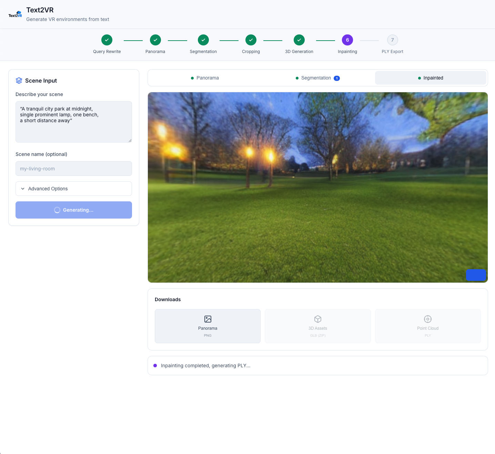

# Text2VR: Text-to-Interactive VR Scene Pipeline

Transform a **single text prompt** into a fully interactive VR-ready 3D scene.

Text2VR orchestrates multiple AI models through a **LangGraph-based workflow** with **Docker Compose microservices**, delivering end-to-end automation from natural language to immersive 3D environments.


---

## Features

- **End-to-End Pipeline**: Text prompt to VR-ready scene in one command
- **LangGraph Orchestration**: Intelligent workflow with automatic query optimization
- **Microservice Architecture**: Isolated, scalable Docker containers for each AI model
- **Real-time Progress**: React frontend with progressive result visualization
- **VRAM Optimization**: Automatic container lifecycle management



---

## Tech Stack

| Layer | Technology |
|-------|------------|
| **Frontend** | React + TypeScript + Vite |
| **Backend** | FastAPI + LangGraph + LangChain |
| **Panorama** | DreamScene360 (Stable Diffusion + Stitch Diffusion) |
| **Segmentation** | GroundingDINO + SAM + GPT-4o |
| **3D Generation** | TRELLIS |
| **Inpainting** | Stable Diffusion 2 Inpaint |
| **3D Scene** | Gaussian Splatting |
| **Infrastructure** | Docker Compose + NVIDIA Container Toolkit |

---

## System Architecture


### Microservices

| Service | Port | Description |
|---------|------|-------------|
| `panorama-api` | 8001 | DreamScene360 - 360° panorama generation |
| `segmentation-api` | 8002 | GroundingDINO + SAM - Asset segmentation |
| `inpainting-api` | 8003 | SD2 Inpaint - Background inpainting |
| `trellis-api` | 8004 | TRELLIS - 2D to 3D asset conversion |

### LangGraph Workflow

```
┌─────────────────┐     ┌─────────────────┐     ┌─────────────────┐
│  Query Rewrite  │────▶│    Panorama     │────▶│  Segmentation   │
│     (LLM)       │     │   Generation    │     │ (DINO+SAM+GPT)  │
└─────────────────┘     └─────────────────┘     └─────────────────┘
                                                        │
┌─────────────────┐     ┌─────────────────┐     ┌───────▼─────────┐
│  PLY Generation │◀────│   Inpainting    │◀────│ 3D Asset Gen    │
│    (GS Train)   │     │     (SD2)       │     │   (TRELLIS)     │
└─────────────────┘     └─────────────────┘     └─────────────────┘
```

---

## Pipeline Stages

### Stage 1: Query Rewrite
Transforms user input into optimized prompts for panorama generation using LLM (GPT-4o).

### Stage 2: Panorama Generation
Generates 360° equirectangular panorama using DreamScene360 with optional self-refinement.

### Stage 3: Asset Segmentation
- **GPT-4o**: Identifies interactive objects in the scene
- **GroundingDINO**: Detects object bounding boxes from text prompts
- **SAM**: Generates precise segmentation masks
- **Asset Cropper**: Extracts individual assets with transparency

### Stage 4: 3D Asset Generation
Converts 2D segmented assets to 3D GLB models using TRELLIS.

### Stage 5: Background Inpainting
Removes segmented objects and fills background seamlessly using Stable Diffusion 2 Inpaint with wrap-aware padding.

### Stage 6: Gaussian Splatting
Trains 3D Gaussian Splatting model from the inpainted panorama for immersive VR rendering.

---

## Results Gallery

| | |
|:---:|:---:|
|  |  |

---

## Prerequisites

- **NVIDIA GPU** with 16GB+ VRAM (recommended: NVIDIA L4 D6 24GB)
- **Docker** and **Docker Compose**
- **NVIDIA Container Toolkit**
- **OpenAI API Key** (for GPT-4o)

---

## Project Structure

```
Text2VR/
├── app/                          # Backend application
│   ├── main.py                   # FastAPI entry point
│   ├── api/                      # API endpoints
│   │   ├── tasks.py              # Task management endpoints
│   │   ├── assets.py             # Asset serving
│   │   └── unity_assets.py       # Unity export endpoints
│   ├── clients/                  # Microservice clients
│   │   ├── panorama.py           # DreamScene360 client
│   │   ├── segmentation.py       # Segmentation client
│   │   ├── inpainting.py         # Inpainting client
│   │   └── trellis.py            # TRELLIS client
│   ├── core/                     # Configuration & utilities
│   │   ├── config.py             # Environment settings
│   │   └── constants.py          # Constants
│   ├── models/                   # Pydantic models
│   ├── services/                 # Business logic
│   │   ├── task_manager.py       # Task state management
│   │   └── panorama_service.py   # Workflow execution
│   └── workflows/                # LangGraph workflow
│       ├── workflow.py           # Main workflow definition
│       └── steps/                # Pipeline stages
├── src/                          # React frontend
│   ├── components/               # UI components
│   ├── services/                 # API service layer
│   └── types/                    # TypeScript definitions
├── DREAMSCENE360/                # Panorama generation service
├── ASSET_SEG/                    # Segmentation service
├── BG_INPAINT/                   # Inpainting service
├── docker-compose.yml            # Service orchestration
├── output/                       # Generated results
└── pre_checkpoints/              # Pretrained model weights
```

---

## Quick Start

### 1. Environment Setup

```bash
# Clone repository
git clone https://github.com/your-repo/Text2VR.git
cd Text2VR

# Create .env file
cat > .env << 'EOF'
OPENAI_API_KEY=your_openai_api_key_here
EOF
```

### 2. Download Pretrained Models

```bash
mkdir -p pre_checkpoints

# SAM checkpoint
wget https://dl.fbaipublicfiles.com/segment_anything/sam_vit_h_4b8939.pth \
  -O pre_checkpoints/sam_vit_h_4b8939.pth

# DreamScene360 DPT-Depth (download from Dropbox)
# https://www.dropbox.com/scl/fo/348s01x0trt0yxb934cwe/h?rlkey=a96g2incso7g53evzamzo0j0y&dl=0
# Place omnidata_dpt_depth_v2.ckpt in pre_checkpoints/
```

### 3. Pull Docker Images from Docker Hub

```bash
# Pull all required images from Docker Hub
docker pull 0in11/text2vr-dreamscene360:v3
docker pull 0in11/text2vr-asset_seg:v2
docker pull 0in11/text2vr-bg_inpaint:v3
docker pull 0in11/trellis:v1
```

> **Note**: These images are pre-built and ready to use. Total download size is approximately 30-40GB.

### 4. Run Services

**Terminal 1: Start AI Services (Docker)**
```bash
# From project root (Text2VR/)
docker-compose up -d
```

**Terminal 2: Start Backend API**
```bash
# From project root (Text2VR/)
uvicorn app.main:app --host 0.0.0.0 --port 8000
```

**Terminal 3: Start Frontend**
```bash
# From project root (Text2VR/src)
npm install  # first time only
npm run dev
```

### 5. Generate VR Scene

1. Open http://localhost:3000 in your browser
2. Enter your scene description (e.g., "A cozy living room with a fireplace")
3. Click Generate and watch the pipeline progress in real-time

---

## API Reference

### Generate Panorama
```
POST /generate
{
  "text": "Scene description",
  "scene_name": "optional_scene_name"
}
```

### Check Status
```
GET /status/{task_id}
```

### Get Panorama Image
```
GET /panorama/{task_id}
```

### List All Tasks
```
GET /tasks
```

---

## Configuration

### Environment Variables

Create a `.env` file in the project root with the following variables:

```bash
# Required
OPENAI_API_KEY=your_openai_api_key_here

# Optional - OpenAI settings
OPENAI_MODEL=gpt-4o              # Default: gpt-4o
OPENAI_TEMPERATURE=0.7           # Default: 0.7

# Optional - Service URLs (if running on different hosts)
DREAMSCENE_API_URL=http://localhost:8001
SEGMENTATION_API_URL=http://localhost:8002
INPAINTING_API_URL=http://localhost:8003
TRELLIS_API_URL=http://localhost:8004

# Optional - Logging
LOG_LEVEL=INFO                   # DEBUG, INFO, WARNING, ERROR
```

Configuration is managed in `app/core/config.py`.

### Workflow Parameters

Pipeline parameters can be customized in `app/core/constants.py`:

#### Panorama Generation
| Parameter | Default | Description |
|-----------|---------|-------------|
| `use_self_refinement` | `False` | Enable iterative refinement for better quality |
| `num_prompt` | `2` | Number of prompt variations to generate |
| `max_rounds` | `2` | Maximum refinement iterations |

#### Inpainting
| Parameter | Default | Description |
|-----------|---------|-------------|
| `strength` | `0.95` | Denoising strength (0.0-1.0) |
| `guidance` | `7.5` | Classifier-free guidance scale |
| `steps` | `40` | Number of inference steps |
| `seed` | `42` | Random seed for reproducibility |

#### 3D Generation (TRELLIS)
| Parameter | Default | Description |
|-----------|---------|-------------|
| `simplify` | `0.95` | Mesh simplification ratio |
| `texture_size` | `1024` | Output texture resolution |
| `ss_sampling_steps` | `12` | Structured latent sampling steps |

#### Gaussian Splatting
| Parameter | Default | Description |
|-----------|---------|-------------|
| `iterations` | `100` | Training iterations |
| `sh_degree` | `3` | Spherical harmonics degree |
| `gen_res` | `512` | Generation resolution |

---

## Development

### Individual Service Development

```bash
# Enter specific container for debugging
docker-compose run --rm panorama-api /bin/bash
docker-compose run --rm segmentation-api /bin/bash
docker-compose run --rm inpainting-api /bin/bash
docker-compose run --rm trellis-api /bin/bash
```

### Frontend Development

```bash
# Install dependencies
npm install

# Start dev server with hot reload
npm run dev

# Build for production
npm run build
```

---

## Troubleshooting

### VRAM Issues
The pipeline automatically stops containers after each stage to free VRAM. If you encounter OOM errors:
```bash
# Manually stop all containers
docker-compose down

# Check GPU memory
nvidia-smi
```

### Service Health Check
```bash
# Check all service logs
docker-compose logs -f

# Check specific service
docker-compose logs panorama-api
```

---

## License

MIT License

---

## Acknowledgments

- [DreamScene360](https://github.com/xxx) - Panorama generation
- [Segment Anything (SAM)](https://github.com/facebookresearch/segment-anything)
- [GroundingDINO](https://github.com/IDEA-Research/GroundingDINO)
- [TRELLIS](https://github.com/xxx) - 3D generation
- [LangGraph](https://github.com/langchain-ai/langgraph) - Workflow orchestration
